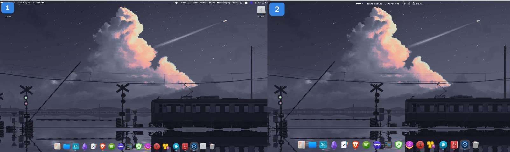

 


---
They’ve got a new installer with Fedora 42 — and I’ve got to say, **this is hands down the best minimal OS installer I’ve seen so far**. I mean, it feels like you’re installing an OS the way you install apps on Windows — just clicking “Yes” all the way through. It’s _that_ smooth.

So I hope you won't have any problem with installing fedora. 
## 🛠️ Post-Install Tweaks (Step-by-Step)

### ⧩ Note

**If your laptop can update firmware without Windows, definitely look into it.**
It’s one of those small things that makes your life easier in the long run.

---

## Network Configuration

I’ve set up a **static IP for my laptop** on my home router using its hardware MAC address. Fedora, by default, uses randomized MACs — great for privacy, sure — but in my case, I have a Nextcloud server that only accepts connections from one static IP (this laptop), so I had to tweak that.

Here’s how you do it:

1. Click on your WiFi network.
    
2. Go to **Identity**, and from the MAC address dropdown, choose your actual hardware MAC.
    
3. Set the **Cloned Address** to **Permanent**.
    
4. Reconnect to your WiFi. Bam — static IP.
    

### Custom DNS

I use Google DNS — but you can set whatever you prefer.  
Turn off automatic DNS for both IPv4 and IPv6 and enter these manually:

```
8.8.8.8, 8.8.4.4 (IPv4)
2001:4860:4860::8888, 2001:4860:4860::8844 (IPv6)
```

### Optional — Speed Up Boot

Run this to disable the network wait-on-boot delay:

```
sudo systemctl disable NetworkManager-wait-online.service
```

---

## Tweaking the DNF Package Manager

Open the DNF config:

```
sudo nano /etc/dnf/dnf.conf
```

Add these lines under `[main]`:

```
max_parallel_downloads=10
fastestmirror=1
```

Then press **Ctrl + X**, then **Y**, and hit **Enter** to save.

BTW, **dnf5** is also auto-installed now — you can use that too if you're curious.

---

## Set Your Hostname

Because seeing “localhost” in the terminal just sucks.

```
sudo hostnamectl set-hostname <yourhostname>
```

Then log out and back in.

---

## Add Repositories

Hope you enabled **Third Party Repositories** during Fedora setup. If not, open **Software → Preferences**, and flip that switch.

Then run these to add **RPM Fusion** and **Flatpak** support:

```
sudo dnf config-manager setopt fedora-cisco-openh264.enabled=1

sudo dnf install https://mirrors.rpmfusion.org/free/fedora/rpmfusion-free-release-$(rpm -E %fedora).noarch.rpm \
https://mirrors.rpmfusion.org/nonfree/fedora/rpmfusion-nonfree-release-$(rpm -E %fedora).noarch.rpm

sudo dnf install rpmfusion-*-appstream-data

flatpak remote-add --if-not-exists flathub https://dl.flathub.org/repo/flathub.flatpakrepo
```

---

## Update the System

```
sudo dnf update
```

Then reboot. After logging back in, run:

```
sudo dnf autoremove
```

to clean up orphaned dependencies and software. 

---

## Installing NVIDIA Drivers

### ⧩ Note

**Don’t just blindly upgrade drivers.** Check the version first — if it’s newer, go ahead. Don’t install random older ones unless you're trying to fix something.

```
sudo dnf install akmod-nvidia
```

**⚠️ Don’t reboot just yet.**

First, check if the drivers are properly loaded:

```
modinfo -F version nvidia
```

If it doesn't returns the NVIDIA driver version, **give it a couple of minutes** (max 5). Then try again:

```
modinfo -F version nvidia
```

Once you see the version info, **now you can reboot**.

After reboot, install the rest:

```
sudo dnf install nvidia-vaapi-driver libva-utils vdpauinfo libva-nvidia-driver xorg-x11-drv-nvidia-cuda
sudo dnf swap mesa-vdpau-drivers mesa-vdpau-drivers-freeworld
sudo dnf swap mesa-va-drivers mesa-va-drivers-freeworld
```

Check if **Nouveau** is disabled:

```
lsmod | grep nouveau
```

If you get nothing, you're good. If not, you'll need to blacklist it — but honestly, that’s rarely needed anymore.

---

## Multimedia Codecs

```
sudo dnf group install multimedia
```


## Install Preload (For Snappy App Launches)

```
sudo dnf copr enable kylegospo/preload -y && sudo dnf install preload -y && sudo systemctl enable --now preload
```

---

## Installing Essential Software

I was genuinely surprised that **Perl** wasn't installed by default. Fedora really embraces the whole **"your laptop, your rules"** philosophy. Unlike Pop!_OS where everything's ready out of the box, here _you_ decide what goes in.

Here’s what I installed:

```
sudo dnf install unzip p7zip p7zip-plugins perl perl-Unicode-Normalize perl-Tk unrar foliate gnome-tweaks fastfetch wget git python3 python3-pip dnfdragora nnn neovim asciinema figlet cowsay hardinfo2 mpv vulkan-tools timeshift zathura zathura-pdf-mupdf

pip3 install --user pynvim
```

---

## Zathura + Neovim + LaTeX Fix

Copy this:

```
/usr/share/applications/org.pwmt.zathura.desktop
```

to:

```
~/.local/share/applications/
```

Then add this line inside the `.desktop` file for both:

```
Exec= env GDK_BACKEND=x11 /usr/bin/zathura %U
```

Without this, you'll get the "Zathura Window ID not found" error when using LaTeX + Neovim + Zathura together.

---

## Disable GNOME Software Auto-Start

Edit the desktop entry:

```
sudo nvim /usr/share/applications/org.gnome.Software.desktop
```

Change it to:

```
[Desktop Entry]
Type=Application
Name=GNOME Software
Exec=/usr/bin/gnome-software --gapplication-service
OnlyShowIn=GNOME;Unity;
NotShowIn=Budgie
NoDisplay=true
X-GNOME-Autostart-enabled=false
Hidden=true
```

Then:

```
mkdir -p ~/.config/autostart
cp /usr/share/applications/org.gnome.Software.desktop ~/.config/autostart/
```

---

## Power Management

### The good old `xset dpms force off`?

No it does not work on Wayland and for obvious reasons. I have given the script in `/.bin/screen`  . Just bind it to a keyboard shortcut.

Fedora’s default GNOME power profiles are decent, but I prefer something more custom. I highly recommend [auto-cpufreq](https://github.com/AdnanHodzic/auto-cpufreq).  
I’ve included a config file — tweak it however you like.

---

## Additional Software Recommendations

```
Calibre  
Obsidian  
Planify  
Ferdium  
Mission Center  
KeePassXC  
Pika Backup  
Keypunch  
Flatseal  
Gear Lever  
Kiwix  
OnlyOffice  
JamesDSP  
Shortwave  
Cosmic Store  
Nvidia System Monitor Qt  
Warehouse  
GDM Settings
```

---

## More Awesome Tools

- [SpeedTest CLI](https://www.speedtest.net/apps/cli) — quick internet speed test 
    
- [YT-DLP](https://github.com/yt-dlp/yt-dlp) — no description needed
    
- [Xtreme Download Manager](https://xtremedownloadmanager.com/) — fantastic for big files
    
- [TestDisk](https://www.cgsecurity.org/wiki/TestDisk_Download) — for serious data recovery
    
- [Starship](https://starship.rs/) — because terminals should look good too

 📌 Put your custom scrips or programs like speedtest and yt-dlp in your ~/.bin folder, that way you can use them anywhere. The `.bashrc` took care of this.

## GNOME Extensions (Highly Recommended)

```
AppIndicator and KStatusNotifierItem Support  
Auto Move Windows  
Battery Health Charging  
Blur my Shell  
Clipboard Indicator  
Dash to Dock  
Dash to Panel  
Fly-Pie  
Gtk4 Desktop Icons NG (DING)  
Hide Top Bar  
Just Perfection  
Lilypad  
Media Controls  
Status Area Horizontal Spacing  
Tiling Shell  
Vitals  
Places Status Indicator
```

---

## Personalization

### Wallpapers

- [orangc's Collection](https://github.com/orangci/walls)
    
- [orangc's Catppuccin-themed Walls](https://github.com/orangci/walls-catppuccin-mocha)
    
- [Wallhaven](https://wallhaven.cc/)


### Icon Packs

- [Kora](https://www.gnome-look.org/p/1256209/)
    
- [Tela](https://www.gnome-look.org/p/1279924)
    
- [Fluent](https://www.gnome-look.org/p/1477945)
    
- [WhiteSur](https://www.gnome-look.org/p/1405756)
    

### GTK Themes

- [WhiteSur](https://www.gnome-look.org/p/1403328)
    
- [Graphite](https://www.gnome-look.org/p/1598493)
    

Also check out [Paul Sørensen’s blog](https://paulsorensen.io/fedora-kde-plasma-post-installation-guide/) — tons of great KDE stuff in there.


## Credits

- Huge respect to the developers and the open source community — seriously, life’s a lot easier because of you all.

#### 🖼 Wallpapers

- [@orangci](https://github.com/orangci) for their beautiful [Wallpaper Collections](https://github.com/orangci/walls) and the Catppuccin-Mocha variant
    
- [Wallhaven](https://wallhaven.cc/) for being the go-to source for high-quality wallpapers
    

#### 🎨 GTK Themes & Icons

- **[WhiteSur Theme](https://www.gnome-look.org/p/1403328)** by vinceliuice
    
- **[Graphite Theme](https://www.gnome-look.org/p/1598493)** by vinceliuice
    
- **[Tela Icons](https://www.gnome-look.org/p/1279924)** by vinceliuice
    
- **[Kora Icons](https://www.gnome-look.org/p/1256209)** by b00merang
    
- **[Fluent Icons](https://www.gnome-look.org/p/1477945)** by vinzv
    

#### 🧠 Special Mention

- [Adnan Hodzic](https://github.com/AdnanHodzic) for [auto-cpufreq](https://github.com/AdnanHodzic/auto-cpufreq) — a life-saver on laptops
    
- [Paul Sørensen](https://paulsorensen.io/who/) for the post-install guide and insights
    

---

> This setup is just a remix of great work done by others. Props to every developer, designer, and Linux user out there who made this possible. ✨
